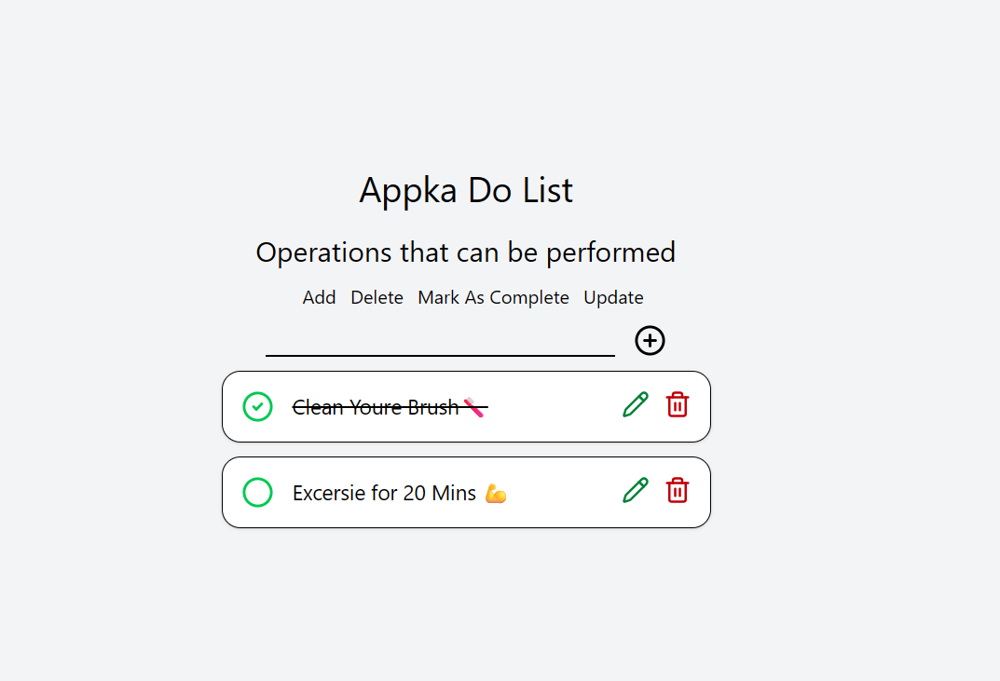

# 📝 React To-Do App

A simple and interactive To-Do application built using **React** and **Tailwind CSS**.
This app allows users to manage daily tasks with features like adding, editing, completing, and deleting tasks.

---

##  Features

* ➕ Add new tasks
* ✔️ Mark tasks as completed
* ✏️ Edit tasks (double click or pencil icon)
* 🗑️ Delete tasks
* 🎨 Clean and responsive UI
* 🔄 Real-time updates using React state

---

## 🧠 Concepts Used

* React Functional Components
* `useState` Hook
* Props & Component Communication
* Lifting State Up
* Conditional Rendering
* Array Methods (`map`, `filter`)
* Immutability in React

---

## 📂 Project Structure

```
src/
│
├── App.jsx                # Main logic and state management
├── Components/
│   ├── Header.jsx        # App header
│   ├── ToDoList.jsx      # Renders list of tasks
│   └── ToDo.jsx          # Individual task component
```

---

## ⚙️ How It Works

### 1. Add Task

* User types in input field
* Click ➕ icon
* New task is added to state

### 2. Toggle Completion

* Click on circle icon
* Task status toggles between completed and not completed

### 3. Edit Task

* Double click task OR click ✏️
* Input field appears
* Press Enter or click outside to save

### 4. Delete Task

* Click 🗑️ icon
* Task is removed from list

---

## 🛠️ Installation

1. Clone the repository:

```
git clone https://github.com/WilliamMark1963/React-ToDoList.git
```

2. Navigate to project folder:

```
cd todo-app
```

3. Install dependencies:

```
npm install
```

4. Run the app:

```
npm run dev
```

---

## 🎯 Future Improvements

* 💾 Save tasks using localStorage
* 🔍 Filter tasks (All / Completed / Pending)
* 🌙 Dark mode
* 🎨 Animations

---

## 📸 Preview



---

## 🤝 Contributing

Feel free to fork this repo and improve the project!

---

## 📄 License

This project is open-source and available under the MIT License.

---
